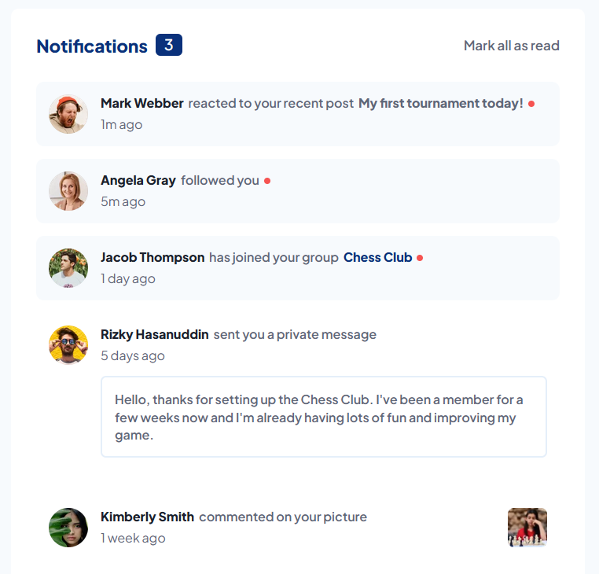

# Frontend Mentor - Notifications page solution

This is a solution to the [Notifications page challenge on Frontend Mentor](https://www.frontendmentor.io/challenges/notifications-page-DqK5QAmKbC).

## Table of contents

-    [Resumo || Overview](#overview)
     -    [O desafio || The challenge](#the-challenge)
     -    [Screenshot](#screenshot)
     -    [Links](#links)
-    [Meu processo || My process](#my-process)
     -    [Feito com || Built with](#built-with)

## Overview

### The challenge

**PT-BR:** Os usuários deveriam ser capazes de:

-    Distinguir entre notificações "lidas" e "não lidas"
-    Selecionar "Marcar todas como lidas" para alterar o estado visual das notificações não lidas e mudar o número de mensagens não lidas para zero
-    Adicionar o layout ótimo para a interface dependendo do tamanho da tela dos seus dispositivos
-    Adicionar hover e focus para todos os elementos interativos na página.

**EN:** Users should be able to:

-    Distinguish between "unread" and "read" notifications
-    Select "Mark all as read" to toggle the visual state of the unread notifications and set the number of unread messages to zero
-    View the optimal layout for the interface depending on their device's screen size
-    See hover and focus states for all interactive elements on the page

### Screenshot

### Links

-    Live Site URL: [GitHub Pages](https://g-pg.github.io/frontendmentor-notifications-page/index.html)

## My process

**PT-BR:** Ao invés de criar as notificações diretamente no HTML, decidi ir para uma direção mais realista, armazenando todas as notificações como objetos em uma array e depois as renderizando na página.

Deste modo elas podem ser atualizadas com variáveis. A pessoa, a mensagem, os links, as fotos etc., mas, especialemnte no caso desse desafio, a proprieade "lido", para a qual defini um valor booleano, atualizado quando o usuário clica no bloco de notificação ou no botão de "Mark all as read" (marcar todas como lidas).

Também deixei a página responsiva, tanto para desktop quanto para mobile.

Eu sou, é claro, um iniciante no Javascript, mas aprendi muito com este pequeno projeto.

**EN:** Instead of making the notifications directly in the HTML, I decided to go for a more realistic approach, storing all the notifications as objects in an array then rendering them on the page.

This way they can be updated with variables. The person, the message, the links, the pictures etc., but specially in the case of this challenge the "read" property, to which I set a boolean value that is updated when the user clicks either the notification block or the "Mark all as read" button.

I also made the page responsive for both desktop and mobile.

I am of course a beginner in Javascript, but I learned a lot with this little project.

### Built with

-    Semantic HTML5 markup
-    CSS custom properties
-    Flexbox
-    Javascript
